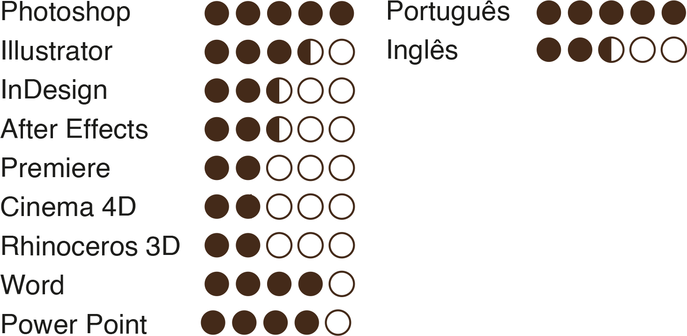

<!DOCTYPE html>
<html>    
    <head>
        <meta charset="utf-8"/>
        <link href="https://fonts.googleapis.com/css2?family=Roboto:wght@700&display=swap" rel="stylesheet"/>
        <link rel="stylesheet" type="text/css" href="estilo.css">
</head>
    <body>
        
 
            

                <td>
                    
<strong>Mateus Durães dos Santos Design</strong>
                    

                        
                    
Olá, tenho 19 anos e estou Cursando design. Sou cristão (protestante), gosto de tocar instrumetos músicais
                             de mexer no computador e criar artes. Nasci e sempre morei no estado de São Paulo, e agora que estou na faculdade estou a procura de oportunidades para
                              aprender, trabalhar e crescer profissionalmente no mercado de trabalho.
                    

                </td>        
            

        

        

            <!-- DIV CORPO FUNDO PRETO-->
            

                

                    <h1 class="títulos">
                        Formação
                    </h1>
                    

                        

                            <li class="links">Design: <strong class="strong">Cursando</strong> (Mackenzie)</li>
                            <li class="links">Inglês: <strong class="strong">Cursando</strong> </li>
                            <li class="links">Ensino médio: <strong class="ad">Completo</strong></li>
                            <li class="links">Técnico em Montagem e Manutenção de
                            Computadores (Escotec, Senai) <strong class="ad">Completo</strong></li>
                        

                    

                    <h1 class="títulos">
                        Conhecimentos
                    </h1>
                    <!--ME EXPLICA, PORQUE "TR" E "TD" TEM QUE ESTAR DENTRO DE TABLE???????????? COMPLICADO....-->
                    <table>
                        <tr align="center">
                            <td width="325" height="180" bgcolor="white" align="center"></td>
                        </tr>
                    </table>
                    <h1 class="títulos">
                        Portifólio
                    </h1>
                    

                        

                            <h1 class="link">
                                

BEHANCE

                            </h1>
                            <h1 class="link">
                                

INSTAGRAM

                            </h1>
                        

                    

                     
                     
                    

                        

                            
                            
                            
                            
                            
                            
                            
                        

                    

                

            

        

        

            

                <table class="faixadentro" >
                    <td>
                        

 Instagram Pessoal

                    </td>
                </table>
            

        

    </body>          
</html>
